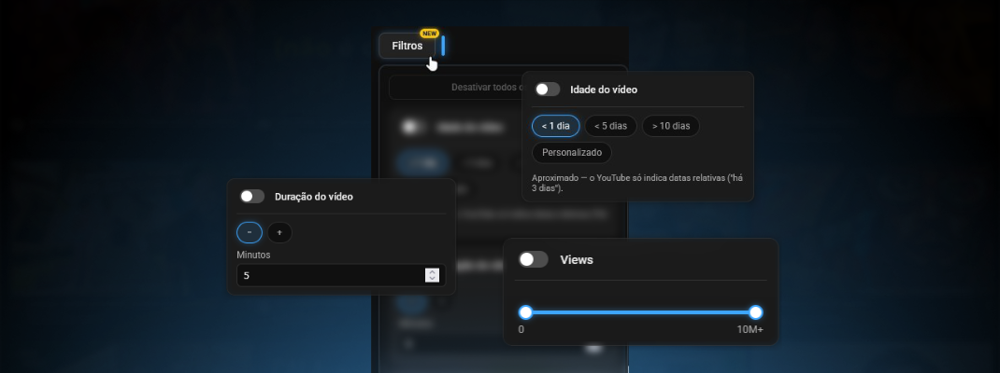

# YT Filter

Extensão de browser (Firefox, com suporte para Chrome a caminho) que
filtra a homepage de recomendações do YouTube — esconde vídeos que não
cumprem os critérios que tu escolheres (idade, duração, views, Shorts,
Mixes/playlists, lives), diretamente no browser, sem interferir com o
algoritmo de recomendação do YouTube.

Não é um bloqueador de anúncios — a extensão nunca toca em anúncios,
nunca os deteta nem os esconde.

## Funcionalidades

- **Idade do vídeo** — presets (`< 1 dia`, `< 5 dias`, `> 10 dias`) ou
  uma data personalizada (antes/depois de).
- **Duração do vídeo** — menos ou mais de N minutos.
- **Views** — intervalo mínimo/máximo, com um slider de `0` a `10M+`.
- **Esconder Shorts** — remove a prateleira de Shorts por completo.
- **Esconder Mixes e playlists**.
- **Esconder lives.**
- Todos os filtros são combináveis, e vêm desligados por default — a
  extensão nunca esconde nada até ativares alguma coisa.
- Um botão flutuante "Filtros" fica sobreposto à página, com o painel
  completo de filtros. É arrastável — agarra pela pequena aba lateral
  (aparece quando aproximas o rato) e larga onde quiseres; encosta
  automaticamente ao lado mais próximo da grid de vídeos.

## Privacidade

Zero recolha de dados, zero telemetria. Ver [docs/PRIVACY.md](docs/PRIVACY.md)
para o detalhe completo.

## Instalação

A extensão ainda não está publicada na [addons.mozilla.org](https://addons.mozilla.org)
nem na Chrome Web Store. Disponivel em breve.

## Contribuir

Issues e pull requests são bem-vindos. Antes de propores uma alteração
grande, abre uma issue a descrever o que tens em mente — o YouTube muda o
DOM com frequência, por isso qualquer alteração aos seletores em
`src/content/selectors.js` deve vir acompanhada de HTML real confirmando
a estrutura atual.

## Licença

[MIT](LICENSE)
